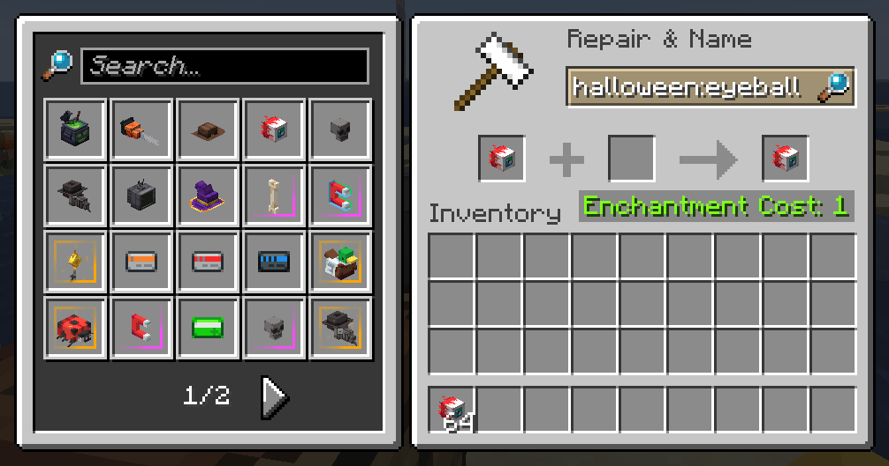

# Model Browser

Display all resource pack-loaded item models directly in-game!

## Usage
The mod adds a widget to the anvil GUI displaying every model currently loaded by any resource packs. If installed on the server-side, clicking an item automatically sets its item model and makes the item equippable on the player's head.

The mod also adds a tab in the Creative inventory for convenient access to every loaded model in Creative Mode.