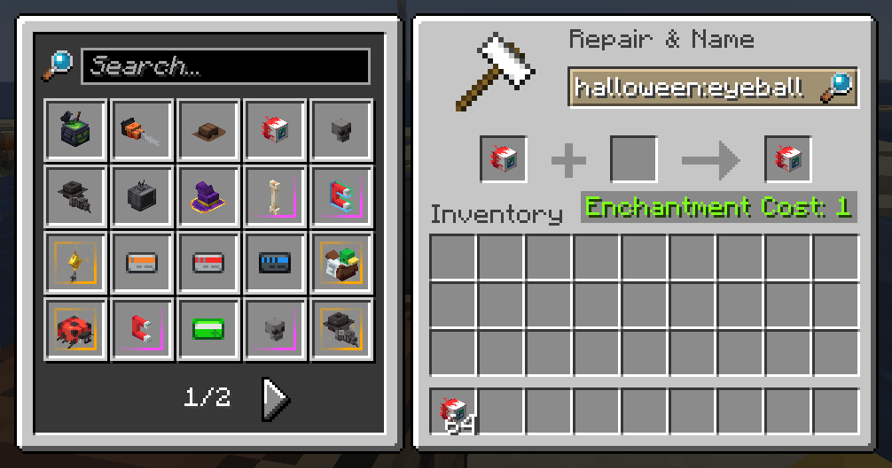

# Model Browser

Display all resource pack-loaded item models directly in-game!

## Usage
The mod adds a widget to the anvil GUI displaying every model currently loaded by any resource packs. If installed on the server-side, clicking an item automatically sets its item model and makes the item equippable on the player's head.

The mod also adds a tab in the Creative inventory for convenient access to every loaded model in Creative Mode.

By default, items that change their model are made equippable to the head slot and have their enchantment glint removed. Operators can change this with:

`/modelbrowser items_always_equippable false|true`

`/modelbrowser items_always_remove_glint false|true`

These settings are saved in `config/modelbrowser-server.json`. The `-e` and `-g` name flags still enable the behavior for individual items when the defaults are disabled.